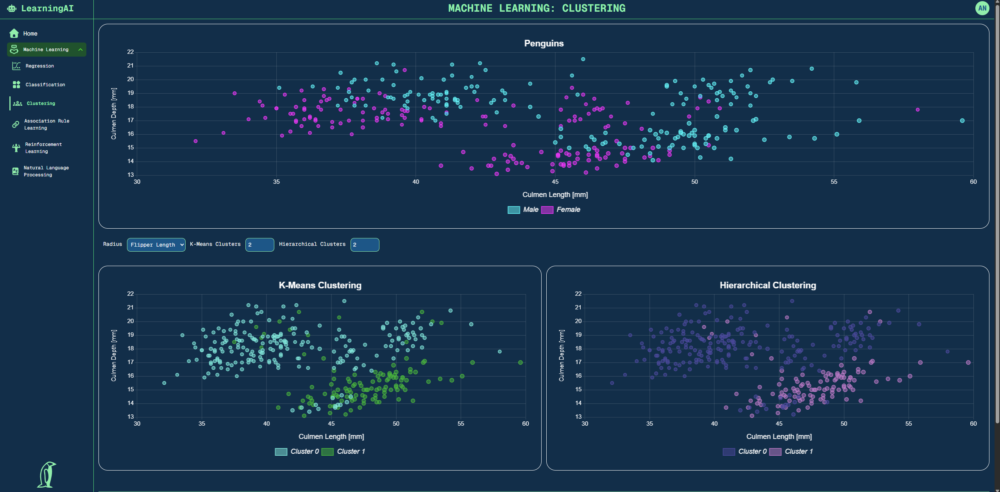
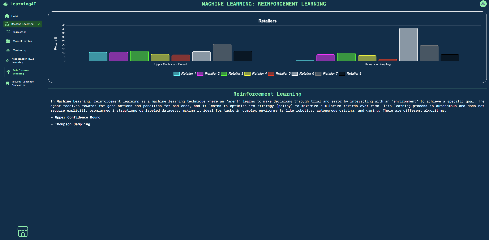
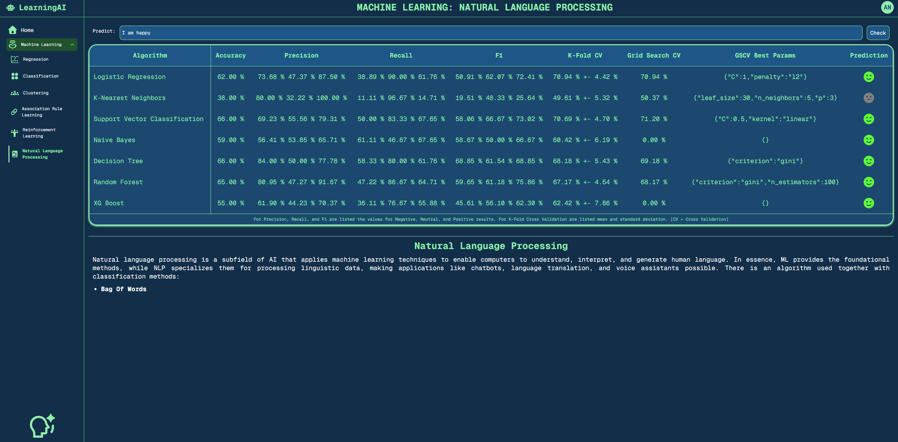

# 🤖 LearningAI

**Web Application to test and compare AI algorithms**

## 📖 Introduction

`LearningAI` is a web application developed after having followed three courses of Artificial Intelligence on **Udemy**:

* `Machine Learning A-Z: AI, Python & R + ChatGPT Prize [2024]`
* `Deep Learning A-Z 2024: Neural Networks, AI & ChatGPT Prize`
* `Artificial Intelligence A-Z 2025: Build 7 AI + LLM & ChatGPT`

The idea was to develop a web app to test and visualize all the algorithms learned in the courses.

### Languages & Libraries

The backend of the application is developed in `Python 3.11.9` using the `FastAPI` library. The main libraries adopted are:

* `fastapi [standard] 0.116.1` for the HTTP API requests
* `numpy 2.3.2` for data manipulation
* `pandas 2.3.1` for data preprocessing
* `pymongo 4.13.2` for data retrieval from a `MongoDB 8.0.11` database
* `sklearn 1.7.1` for **Machine Learning** algorithms

The frontend is developed in `Next.js 15.4.4` based on `Node.js 24.4.0`. The main libraries adopted are:

* `react 19.1.0` as JavaScript framework
* `typescript 5.8.3` for JavaScript type safe management
* `tailwindcss 4.1.11` for all UI/UX
* `axios 1.11.0` for HTTP requests to the backend
* `chartjs 4.1.11` for all graphics
* `framer-motion 12.23.12` for menu animation

### Project's Structure

The project is structured in the following folders:

* `.venv`: contains the Python virtual environment
* `fastapi-server`: the backend application
* `images`: README images
* `nextjs-client`: the frontend application

### References

#### Books

#### GitHub Repositories

> **side-nav-with-submenus**
> - `URL` https://github.com/hqasmei/youtube-tutorials/tree/main/side-nav-with-submenus

## 💻 Machine Learning

### Regression

### Classification

### Clustering

### Association Rule Learning

### Reinforcement Learning

### Natural Language Processing

## 🧠 Deep Learning

### Artificial Neural Network

